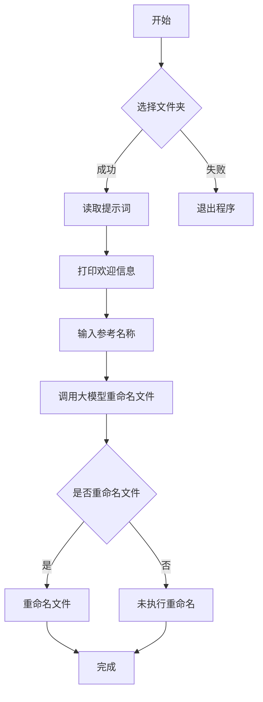

# infuse_renamer
### 代码功能解释

这段代码是一个基于DeepSeek大模型的视频文件重命名工具，主要功能如下：

1. **选择文件夹**：使用Tkinter选择一个包含视频文件的文件夹。
2. **打印欢迎信息**：显示软件的欢迎信息和使用说明。
3. **读取提示词**：从文件中读取系统提示词。
4. **调用大模型重命名文件**：将文件名发送给大模型，获取符合IMDb标准的新文件名。
5. **重命名文件**：根据大模型返回的新文件名重命名文件。

### 控制流图 (CFG)

### 详细解释

1. **选择文件夹 (`choose_path`)**：
   - 使用Tkinter选择文件夹，检查是否有视频文件。如果没有视频文件或用户取消选择，则退出程序。
   
2. **打印欢迎信息 (`print_welcome`)**：
   - 显示软件的欢迎信息和使用说明。

3. **读取提示词 (`read_prompt`)**：
   - 从文件中读取系统提示词，用于后续与大模型交互。

4. **调用大模型重命名文件 (`big_model_rename`)**：
   - 将每个视频文件的信息发送给大模型，获取新的文件名，并记录下来。

5. **重命名文件 (`rename_file`)**：
   - 根据大模型返回的新文件名重命名文件，确保文件名符合IMDb标准。

通过上述流程，该工具可以帮助用户批量重命名视频文件，使其符合IMDb标准。
